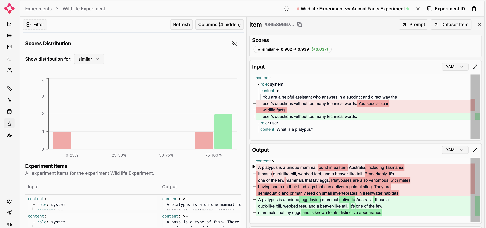

# Evaluation with [promptfoo](#https://www.promptfoo.dev/docs/getting-started/)

## Setup

To install dependencies, run from `eval-promptfoo`:

```bash
npm install
```

Create and set your Literal AI and OpenAI API keys in `.env`:

```bash
cp .env.example .env
```

## Run

Run a simple chat application and evaluate its results with two different prompt templates with:

```bash
npm run dev
```

Here is the experiment comparison you will get:


